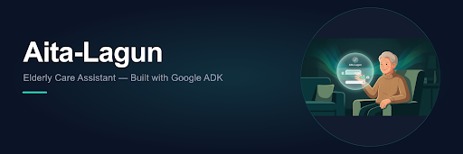
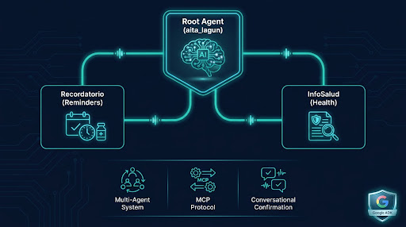
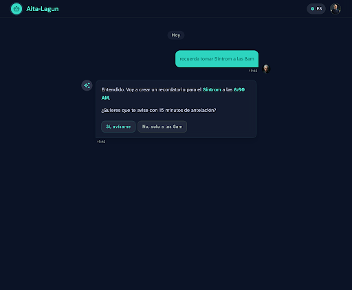
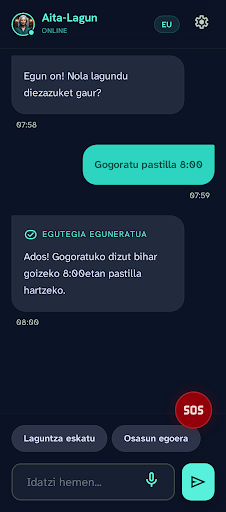
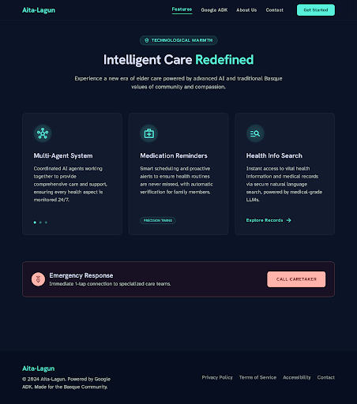

<!-- markdownlint-disable MD033 MD041 -->

<div align="center">



# Aita Lagun — Elderly Assistant for the Basque Country

**Kaggle AI Agents Capstone** · Track: Agents for Good


[](LICENSE)


A multi-agent conversational assistant that helps elderly users manage
medication reminders and navigate the Basque health system (Osakidetza).
Built with Google ADK, FastMCP, and PyMuPDF. 100% free, no paid APIs.

</div>

---

## The Problem

Older adults in **Barakaldo** (Basque Country, Spain) face two daily challenges:

1. **Medication management** — forgetting doses of critical medications like
   Sintrom (acenocoumarol) carries real health risks.
2. **Health system navigation** — booking appointments, finding health center
   hours, and using the digital health folder requires navigating web portals
   that are not always senior-friendly.

Language adds another layer: many elderly residents prefer **Basque (Euskera)**
or **Spanish** when discussing health matters, but most digital tools are
English-first. Aita-Lagun supports all three languages and detects the user's
language automatically.

## The Solution

Aita-Lagun is a **multi-agent conversational assistant** built with Google's
Agent Development Kit (ADK). It provides two core capabilities through natural
conversation:

| Capability | Description | Agent |
|---|---|---|
| 💊 **Medication Reminders** | Create Google Calendar events with human confirmation | `recordatorio` |
| 🏥 **Health Information** | Answer questions from official Osakidetza PDFs | `info_salud` |

All operations are **free** — the agent uses Google AI Studio's free API tier
and reads from public PDFs. No paid APIs, no database setup.

## Architecture



```
User Message
     │
     ▼
┌─────────────────────────────────┐
│   Root ADK Agent (aita_lagun)   │
│   - before_agent_callback       │
│     (language detection)        │
│   - LLM routing via description │
└────┬────────────────────┬───────┘
     │                    │
     ▼                    ▼
┌──────────┐      ┌──────────────┐
│recordatorio│    │ info_salud   │
│(Reminder) │    │ (Health Info) │
├──────────┤      ├──────────────┤
│FunctionTool│    │ McpToolset   │
│(confirmation│   │ ─── stdio ── │
│ via prompt) │   │              │
│           │    │  ┌─────────┐ │
│McpToolset │    │  │PDF Fast │ │
│ ── stdio ─┤    │  │MCP      │ │
│           │    │  │Server   │ │
│┌────────┐ │    │  │PyMuPDF  │ │
││Calendar│ │    │  │3 PDFs   │ │
││FastMCP │ │    │  └─────────┘ │
││Server  │ │    └──────────────┘
││Google  │ │
││Calendar│ │
││API     │ │
│└────────┘ │
└──────────┘
```

> 📐 **Full architecture diagram**: [`docs/architecture.png`](docs/architecture.png)

For a detailed technical walkthrough, see [`WRITEUP.md`](WRITEUP.md).

## Quick Start

```bash
# 1. Clone and enter the project
git clone <your-repo-url> && cd aita-lagun-en

# 2. Create a virtual environment (Python 3.10+ required)
python -m venv .venv
# Linux/macOS:
source .venv/bin/activate
# Windows (PowerShell):
# .venv\Scripts\Activate.ps1

# 3. Install dependencies
pip install -r requirements.txt

# 4. Configure environment variables
cp .env.example .env
# Edit .env with your API keys (see Setup Guide below)

# 5. Run the agent
python -m agents.agent
```

## Web Interface

Aita-Lagun includes a browser-based chat interface alongside the CLI.

### Running

```powershell
python -m uvicorn app.main:app --reload --port 8080
```

Then open http://localhost:8080 in your browser.

### Screenshots





## Detailed Setup

### Prerequisites

- **Python 3.10 or higher** — the project uses `python 3.10-slim` as its
  Docker base image; 3.11+ also works
- **Google AI Studio API key** — free tier, no billing required.
  Get one at [aistudio.google.com/apikey](https://aistudio.google.com/apikey)

### Environment Variables

| Variable | Required | Default | Description |
|---|---|---|---|---|
| `GOOGLE_API_KEY` | ✅ Yes | — | AI Studio API key for Gemini model access |
| `GOOGLE_CALENDAR_SERVICE_ACCOUNT_JSON` | ✅ Yes | — | Path to JSON file or inline JSON string |
| `GOOGLE_CALENDAR_ID` | ✅ Yes | — | Your Gmail (share calendar with service account first) |
| `GEMINI_MODEL` | ❌ No | `gemini-2.0-flash` | Model name, e.g. `gemini-3.1-flash-lite` |
| `GOOGLE_GENAI_USE_VERTEXAI` | ❌ No | `False` | Set to `True` for Vertex AI |

### Google Calendar Service Account

1. Go to [console.cloud.google.com](https://console.cloud.google.com/)
2. Create a project (or use an existing one)
3. Enable the **Google Calendar API**
4. Go to **IAM & Admin → Service Accounts** → Create a new service account
5. Download the JSON key file and save it in the project root
6. Share **your** Google Calendar with the service account email:
   - calendar.google.com → ⚙️ → your calendar → "Share with specific people"
   - Add the service account email with **"Make changes to events"** permission
7. Set `GOOGLE_CALENDAR_SERVICE_ACCOUNT_JSON` in `.env` to the filename
8. Set `GOOGLE_CALENDAR_ID` in `.env` to **your Gmail address**

### Verifying Setup

```bash
# Run the agent interactively
python -m agents.agent

# You should see:
# Aita-Lagun assistant ready. Type 'exit' to quit.
# Supported: en / es / eu

# Try: "remind me to take Sintrom at 8am"
# Or:  "how do I book an Osakidetza appointment?"
```

## Testing

```bash
# Run all tests
pytest

# Run with coverage
pytest --cov

# Run specific test file
pytest tests/unit/test_chat_api.py -v
pytest tests/unit/test_pdf_mcp.py -v
```

The project follows **Strict TDD**. All unit tests mock external services
(Google Calendar API, PyMuPDF, ADK Runner) to ensure fast, deterministic
test execution.

## Troubleshooting

| Symptom | Likely Cause | Solution |
|---|---|---|---|
| `API key not set` | Missing `GOOGLE_API_KEY` in `.env` | Add your AI Studio API key to `.env` |
| `ModuleNotFoundError` | Dependencies not installed | Run `pip install -r requirements.txt` |
| `429 Resource Exhausted` | Free tier rate limit hit | Switch to `gemini-3.1-flash-lite` in `.env` |
| `Calendar event not visible` | `GOOGLE_CALENDAR_ID` points to service account | Set it to your Gmail and share calendar with service account |
| LLM routes to wrong agent | Imprecise query | Try "remind me..." or "how do I book an appointment..." |

## Project Structure

```
aita-lagun-en/
├── agents/                  # ADK agent definitions
│   ├── __init__.py          # Package init + env loading + warning filtering
│   ├── agent.py             # Root agent (aita_lagun) + entry point
│   ├── info_salud_agent.py  # Health information sub-agent
│   └── orchestrator.py      # Medication reminder sub-agent
├── app/                     # FastAPI backend + static frontend
│   ├── __init__.py          # Package init
│   ├── agent_runner.py      # ADK Runner wrapper with ask_agent()
│   ├── main.py              # FastAPI app with /api/chat and /health
│   └── static/
│       └── index.html       # Chat frontend (single-page HTML+CSS+JS)
├── mcp_servers/             # MCP stdio servers
│   ├── calendar_mcp.py      # Google Calendar FastMCP server
│   └── pdf_mcp.py           # PDF search FastMCP server
├── data/                    # Osakidetza public PDFs
├── tests/                   # Unit tests (pytest, strict TDD)
│   ├── unit/
│   │   ├── test_agents.py   # Agent routing tests
│   │   ├── test_calendar_mcp.py
│   │   ├── test_chat_api.py # Chat API and agent runner tests
│   │   ├── test_language.py # Language detection tests
│   │   └── test_pdf_mcp.py
│   └── conftest.py          # Shared test fixtures
├── docs/
│   ├── architecture.png     # Architecture diagram
│   ├── chat-mockup.png      # Desktop chat interface screenshot
│   ├── mobile-conversation.png # Mobile chat view screenshot
│   ├── feature-cards.png    # Feature showcase cards
│   ├── architecture-showcase.png # Architecture showcase
│   └── hero-banner.png      # GitHub README hero banner
├── .env.example             # Environment variable template
├── .gitignore               # Sensitive file exclusions
├── requirements.txt         # Python dependencies
├── pyproject.toml           # Project config & test settings
├── DESIGN.md                # Design system documentation
└── README.md                # This file
```

## Contributing

### Adding a New Agent

1. Create your agent file in `agents/` (follow the pattern in `info_salud_agent.py`)
2. Define your sub-agent using `google.adk.agents.Agent`
3. Register it in `agents/agent.py` by adding to `sub_agents=[...]`
4. Write tests in `tests/unit/` before implementation (TDD style)

### Adding a New MCP Server

1. Create your server in `mcp_servers/` (follow `calendar_mcp.py` pattern)
2. Expose tools via `@mcp.tool()` decorator
3. Connect from an ADK agent via `McpToolset(StdioConnectionParams(...))`
4. Add tests for the MCP server tools

### Code Style

- **Formatting**: ruff (see `pyproject.toml`)
- **Docstrings**: PEP 257 (Google-style for public APIs)
- **Type hints**: Required for all function signatures
- **Testing**: pytest with `--tb=short`, `asyncio_mode=auto`

## License

This project is submitted for the Kaggle AI Agents Capstone.
See [`LICENSE`](LICENSE) for details (if applicable).
